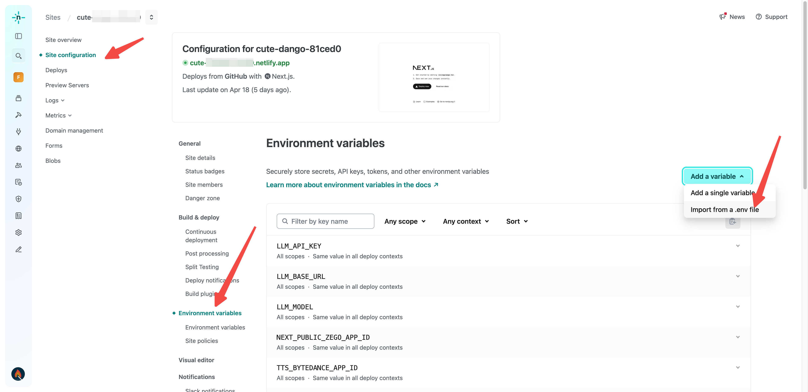
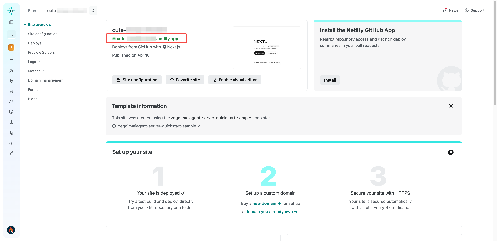
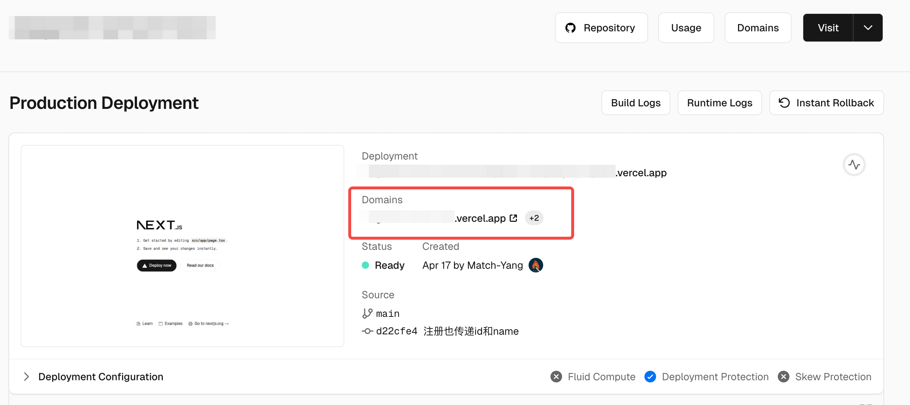

# AI Agent 服务端示例使用说明
## 本地运行

你可以在本地安装依赖环境后，在本地启动服务端，然后客户端通过连接到同一个局域网访问相应接口。

1. 请安装[Node.js 18.18](https://nodejs.org/)或以上版本。
2. 将本仓库代码下载至本地
3. 将 `.env.example` 文件拷贝为 `.env` 并按说明填写好所有环境变量的值（如ZEGO APPID、LLM、TTS）。
4. 进入项目根目录运行以下命令以启动服务。
```bash
npm install
npm run dev
```

运行完成后，可以打开 [http://localhost:3000](http://localhost:3000) 查看运行结果。

在运行成功后，即可调用以下接口：
1. 注册：`http://localhost:3000/api/agent/register`
2. 创建实例 `http://localhost:3000/api/agent/create`
3. 删除实例 `http://localhost:3000/api/agent/delete`
4. 获取ZEGO Token `http://localhost:3000/api/zegotoken`

注意：如果是在 PC/Mac 上运行服务端然后在 Android 或者 iOS 等移动设备上调试，请把 `localhost` 替换成 PC/Mac 的实际局域网地址进行访问。

## 部署到 Netlify

请注意⚠️：中国大陆建议使用该方式

[](https://app.netlify.com/start/deploy?repository=https://github.com/ZEGOCLOUD/ai_agent_quick_start_server)

点击上方按钮可以一键将此项目部署到 Netlify 平台。
部署过程中，您需要导入所有必要的环境变量。具体步骤如下：

1. 在 Netlify 平台跳转到 `你的Site实例 -> Site configuration -> Environment variables`
2. 点击右侧的 `Add a variable` 并选择 `Import from a .env file`，然后将以下内容拷贝到输入框（Contents of .env file:）中，然后点击 `Import variables`。
```bash
# 请替换成您实际的内容
NEXT_PUBLIC_ZEGO_APP_ID=
ZEGO_SERVER_SECRET=

LLM_API_KEY=
LLM_BASE_URL=https://ark.cn-beijing.volces.com/api/v3
LLM_MODEL=deepseek-v3-250324

TTS_BYTEDANCE_APP_ID=4******9
TTS_BYTEDANCE_TOKEN=N8I************************stqp
TTS_BYTEDANCE_CLUSTER=volcano_tts
TTS_BYTEDANCE_VOICE_TYPE=zh_female_wanwanxiaohe_moon_bigtts
```

3. 跳转到 `Deploys` 页面并点击右侧的 `Trigger deploy` 然后选择 `Deploy site` 选项触发网站重新构建

4. 部署完成后，在 `Site overview` 页面即可查看到您网站的域名。


使用该域名可访问API接口：
1. 注册：`https://cute-******.netlify.app/api/agent/register`
2. 创建实例 `https://cute-******.netlify.app/api/agent/create`
3. 删除实例 `https://cute-******.netlify.app/api/agent/delete`
4. 获取ZEGO Token `https://cute-******.netlify.app/api/zegotoken`

## 部署到 Vercel

请注意⚠️：中国大陆访问Vercel可能会有问题。如果无法访问请科学上网。在部署好后的服务绑定自己申请的域名也可以正常访问（注意域名被墙的风险）。

[](https://vercel.com/new/clone?repository-url=https%3A%2F%2Fgithub.com%2FZEGOCLOUD%2Fai_agent_quick_start_server&env=NEXT_PUBLIC_ZEGO_APP_ID,ZEGO_SERVER_SECRET,LLM_API_KEY,LLM_BASE_URL,LLM_MODEL,TTS_BYTEDANCE_APP_ID,TTS_BYTEDANCE_TOKEN,TTS_BYTEDANCE_CLUSTER,TTS_BYTEDANCE_VOICE_TYPE&envDescription=这些是启动ZEGO的AI代理服务器所需的环境变量。请查看下方文档获取更多信息。&envLink=https://github.com/zegoim/aiagent-server-quickstart-sample/blob/main/.env.example)

点击上方按钮可以一键将此项目部署到Vercel平台。部署过程中，您需要填写所有必要的环境变量。关于环境变量的详细说明，请参考[.env.example](.env.example)文件。



使用该域名可访问API接口：
1. 注册：`https://****.vercel.app/api/agent/register`
2. 创建实例 `https://****.vercel.app/api/agent/create`
3. 删除实例 `https://****.vercel.app/api/agent/delete`
4. 获取ZEGO Token `https://****.vercel.app/api/zegotoken`

## 项目结构

项目源代码结构如下：

```
src
├── app
│   ├── api
│   │   ├── agent
│   │   │   ├── register
│   │   │   │   └── route.ts        # 注册AI Agent
│   │   │   ├── create
│   │   │   │   └── route.ts        # 创建AI Agent 实例
│   │   │   ├── delete
│   │   │   │   └── route.ts        # 删除AI Agent实例
│   │   │   └── types.ts            # 类型定义
│   │   └── zegotoken
│   │       └── route.ts            # ZEGO Token生成API
└── lib
    ├── logger.ts                   # 日志工具
    └── zego
        ├── aiagent.ts              # ZEGO AI Agent PaaS 接口请求逻辑
        └── token_helper.ts         # ZEGO Token生成工具
```

## API接口调用示例

本示例提供了以下几个主要API接口：

1. 注册：`/api/agent/register`：用于注册AI Agent，需要传入agent_id和agent_name参数。注册后可创建实例。建议在APP初始化后就调用。
2. 创建实例 `/api/agent/create`：用于创建AI Agent实例，需要传入agent_id(注册时使用的ID)和房间信息。创建后自动加入房间与用户对话。
3. 删除实例 `/api/agent/delete`：用于删除AI Agent实例。
4. 获取ZEGO Token `/api/zegotoken`：用于获取ZEGO服务所需的token。

### 接口返回格式

所有接口的返回格式统一为JSON，包含以下字段：

#### 成功返回
```json
{
  "code": 0,
  "message": "操作成功的消息",
  // 其他数据字段（根据接口不同而不同）
}
```

#### 错误返回
```json
{
  "code": 错误码,  // 非0值
  "message": "错误信息"
}
```

#### 各接口特有的返回字段

1. `/api/agent/register` 成功返回：
```json
{
  "code": 0,
  "message": "register agent success",
  "agent_id": "注册的agent_id",
  "agent_name": "注册的agent_name"
}
```

2. `/api/agent/create` 成功返回：
```json
{
  "code": 0,
  "message": "create agent instance success",
  "agent_instance_id": "创建的AI Agent实例ID"
}
```

3. `/api/agent/delete` 成功返回：
```json
{
  "code": 0,
  "message": "delete agent instance success"
}
```

4. `/api/zegotoken` 成功返回：
```json
{
  "code": 0,
  "message": "delete agent instance success",
  "token": "生成的ZEGO token",
  "user_id": "请求的用户ID",
  "expire_time": 过期时间戳
}
```

下面是使用不同编程语言调用这些接口的示例：

### cURL 示例

```bash
# 1. 注册AI Agent
curl -X POST https://你的服务域名/api/agent/register \
  -H "Content-Type: application/json" \
  -d '{
    "agent_id": "your_agent_id",
    "agent_name": "Your Agent Name"
  }'

# 2. 创建AI Agent实例
curl -X POST https://你的服务域名/api/agent/create \
  -H "Content-Type: application/json" \
  -d '{
    "agent_id": "your_agent_id",
    "room_id": "room123",
    "user_id": "user123",
    "user_stream_id": "stream_user123",
    "agent_stream_id": "stream_agent123",
    "agent_user_id": "agent123"
  }'

# 3. 删除AI Agent实例
curl -X POST https://你的服务域名/api/agent/delete \
  -H "Content-Type: application/json" \
  -d '{
    "agent_instance_id": "agentInstanceId123"
  }'

# 4. 获取ZEGO Token
curl -X GET "https://你的服务域名/api/zegotoken?userId=user123"
```

### Android Java 示例

```java
// 导入所需的包
import java.io.IOException;
import okhttp3.MediaType;
import okhttp3.OkHttpClient;
import okhttp3.Request;
import okhttp3.RequestBody;
import okhttp3.Response;
import org.json.JSONObject;

public class ZegoApiExample {
    private static final String BASE_URL = "https://你的服务域名";
    private static final MediaType JSON = MediaType.parse("application/json; charset=utf-8");
    private static final OkHttpClient client = new OkHttpClient();
    
    // 1. 注册AI Agent
    public static void registerAgent(String agentId, String agentName) throws IOException {
        JSONObject json = new JSONObject();
        json.put("agent_id", agentId);
        json.put("agent_name", agentName);
        
        RequestBody body = RequestBody.create(json.toString(), JSON);
        Request request = new Request.Builder()
                .url(BASE_URL + "/api/agent/register")
                .post(body)
                .build();
        
        try (Response response = client.newCall(request).execute()) {
            System.out.println(response.body().string());
        }
    }
    
    // 2. 创建AI Agent实例
    public static void createAgentInstance(String agentId, String roomId, String userId, String userStreamId, 
                                 String agentStreamId, String agentUserId) throws IOException {
        JSONObject json = new JSONObject();
        json.put("agent_id", agentId);
        json.put("room_id", roomId);
        json.put("user_id", userId);
        json.put("user_stream_id", userStreamId);
        json.put("agent_stream_id", agentStreamId);
        json.put("agent_user_id", agentUserId);
        
        RequestBody body = RequestBody.create(json.toString(), JSON);
        Request request = new Request.Builder()
                .url(BASE_URL + "/api/agent/create")
                .post(body)
                .build();
        
        try (Response response = client.newCall(request).execute()) {
            System.out.println(response.body().string());
        }
    }
    
    // 3. 删除AI Agent实例
    public static void deleteAgentInstance(String agentInstanceId) throws IOException {
        JSONObject json = new JSONObject();
        json.put("agent_instance_id", agentInstanceId);
        
        RequestBody body = RequestBody.create(json.toString(), JSON);
        Request request = new Request.Builder()
                .url(BASE_URL + "/api/agent/delete")
                .post(body)
                .build();
        
        try (Response response = client.newCall(request).execute()) {
            System.out.println(response.body().string());
        }
    }
    
    // 4. 获取ZEGO Token
    public static void getZegoToken(String userId) throws IOException {
        Request request = new Request.Builder()
                .url(BASE_URL + "/api/zegotoken?userId=" + userId)
                .get()
                .build();
        
        try (Response response = client.newCall(request).execute()) {
            System.out.println(response.body().string());
        }
    }
}
```

### iOS Objective-C 示例

```objective-c
#import <Foundation/Foundation.h>

@interface ZegoApiExample : NSObject

+ (void)registerAgentWithId:(NSString *)agentId name:(NSString *)agentName;
+ (void)createAgentWithId:(NSString *)agentId
                   roomId:(NSString *)roomId
                   userId:(NSString *)userId
             userStreamId:(NSString *)userStreamId
           agentStreamId:(NSString *)agentStreamId
             agentUserId:(NSString *)agentUserId;
+ (void)deleteAgentWithInstanceId:(NSString *)agentInstanceId;
+ (void)getZegoTokenWithUserId:(NSString *)userId;

@end

@implementation ZegoApiExample

// 基础URL
static NSString *const kBaseUrl = @"https://你的服务域名";

// 1. 注册AI Agent
+ (void)registerAgentWithId:(NSString *)agentId name:(NSString *)agentName {
    NSURL *url = [NSURL URLWithString:[kBaseUrl stringByAppendingString:@"/api/agent/register"]];
    NSMutableURLRequest *request = [NSMutableURLRequest requestWithURL:url];
    [request setHTTPMethod:@"POST"];
    [request setValue:@"application/json" forHTTPHeaderField:@"Content-Type"];
    
    NSDictionary *body = @{
        @"agent_id": agentId,
        @"agent_name": agentName
    };
    
    NSError *error;
    NSData *bodyData = [NSJSONSerialization dataWithJSONObject:body 
                                                       options:0 
                                                         error:&error];
    if (error) {
        NSLog(@"JSON序列化错误: %@", error);
        return;
    }
    
    [request setHTTPBody:bodyData];
    
    NSURLSession *session = [NSURLSession sharedSession];
    NSURLSessionDataTask *task = [session dataTaskWithRequest:request 
                                            completionHandler:^(NSData *data, NSURLResponse *response, NSError *error) {
        if (error) {
            NSLog(@"Error: %@", error);
            return;
        }
        
        NSHTTPURLResponse *httpResponse = (NSHTTPURLResponse *)response;
        if (httpResponse.statusCode == 200) {
            NSError *jsonError;
            NSDictionary *json = [NSJSONSerialization JSONObjectWithData:data 
                                                                 options:0 
                                                                   error:&jsonError];
            if (jsonError) {
                NSLog(@"JSON解析错误: %@", jsonError);
                return;
            }
            
            NSLog(@"注册Agent成功: %@", json);
        } else {
            NSLog(@"请求失败，状态码: %ld", (long)httpResponse.statusCode);
        }
    }];
    
    [task resume];
}

// 2. 创建AI Agent实例
+ (void)createAgentWithId:(NSString *)agentId
                   roomId:(NSString *)roomId
                   userId:(NSString *)userId
             userStreamId:(NSString *)userStreamId
           agentStreamId:(NSString *)agentStreamId
             agentUserId:(NSString *)agentUserId {
    NSURL *url = [NSURL URLWithString:[kBaseUrl stringByAppendingString:@"/api/agent/create"]];
    NSMutableURLRequest *request = [NSMutableURLRequest requestWithURL:url];
    [request setHTTPMethod:@"POST"];
    [request setValue:@"application/json" forHTTPHeaderField:@"Content-Type"];
    
    NSDictionary *body = @{
        @"agent_id": agentId,
        @"room_id": roomId,
        @"user_id": userId,
        @"user_stream_id": userStreamId,
        @"agent_stream_id": agentStreamId,
        @"agent_user_id": agentUserId
    };
    
    NSError *error;
    NSData *bodyData = [NSJSONSerialization dataWithJSONObject:body 
                                                       options:0 
                                                         error:&error];
    if (error) {
        NSLog(@"JSON序列化错误: %@", error);
        return;
    }
    
    [request setHTTPBody:bodyData];
    
    NSURLSession *session = [NSURLSession sharedSession];
    NSURLSessionDataTask *task = [session dataTaskWithRequest:request 
                                            completionHandler:^(NSData *data, NSURLResponse *response, NSError *error) {
        if (error) {
            NSLog(@"Error: %@", error);
            return;
        }
        
        NSHTTPURLResponse *httpResponse = (NSHTTPURLResponse *)response;
        if (httpResponse.statusCode == 200) {
            NSError *jsonError;
            NSDictionary *json = [NSJSONSerialization JSONObjectWithData:data 
                                                                 options:0 
                                                                   error:&jsonError];
            if (jsonError) {
                NSLog(@"JSON解析错误: %@", jsonError);
                return;
            }
            
            NSLog(@"创建Agent实例成功: %@", json);
        } else {
            NSLog(@"请求失败，状态码: %ld", (long)httpResponse.statusCode);
        }
    }];
    
    [task resume];
}

// 3. 删除AI Agent实例
+ (void)deleteAgentWithInstanceId:(NSString *)agentInstanceId {
    NSURL *url = [NSURL URLWithString:[kBaseUrl stringByAppendingString:@"/api/agent/delete"]];
    NSMutableURLRequest *request = [NSMutableURLRequest requestWithURL:url];
    [request setHTTPMethod:@"POST"];
    [request setValue:@"application/json" forHTTPHeaderField:@"Content-Type"];
    
    NSDictionary *body = @{
        @"agent_instance_id": agentInstanceId
    };
    
    NSError *error;
    NSData *bodyData = [NSJSONSerialization dataWithJSONObject:body 
                                                       options:0 
                                                         error:&error];
    if (error) {
        NSLog(@"JSON序列化错误: %@", error);
        return;
    }
    
    [request setHTTPBody:bodyData];
    
    NSURLSession *session = [NSURLSession sharedSession];
    NSURLSessionDataTask *task = [session dataTaskWithRequest:request 
                                            completionHandler:^(NSData *data, NSURLResponse *response, NSError *error) {
        if (error) {
            NSLog(@"Error: %@", error);
            return;
        }
        
        NSHTTPURLResponse *httpResponse = (NSHTTPURLResponse *)response;
        if (httpResponse.statusCode == 200) {
            NSError *jsonError;
            NSDictionary *json = [NSJSONSerialization JSONObjectWithData:data 
                                                                 options:0 
                                                                   error:&jsonError];
            if (jsonError) {
                NSLog(@"JSON解析错误: %@", jsonError);
                return;
            }
            
            NSLog(@"删除Agent实例成功: %@", json);
        } else {
            NSLog(@"请求失败，状态码: %ld", (long)httpResponse.statusCode);
        }
    }];
    
    [task resume];
}

// 4. 获取ZEGO Token
+ (void)getZegoTokenWithUserId:(NSString *)userId {
    NSString *urlString = [NSString stringWithFormat:@"%@/api/zegotoken?userId=%@", kBaseUrl, userId];
    NSURL *url = [NSURL URLWithString:urlString];
    NSMutableURLRequest *request = [NSMutableURLRequest requestWithURL:url];
    [request setHTTPMethod:@"GET"];
    
    NSURLSession *session = [NSURLSession sharedSession];
    NSURLSessionDataTask *task = [session dataTaskWithRequest:request 
                                            completionHandler:^(NSData *data, NSURLResponse *response, NSError *error) {
        if (error) {
            NSLog(@"Error: %@", error);
            return;
        }
        
        NSHTTPURLResponse *httpResponse = (NSHTTPURLResponse *)response;
        if (httpResponse.statusCode == 200) {
            NSError *jsonError;
            NSDictionary *json = [NSJSONSerialization JSONObjectWithData:data 
                                                                 options:0 
                                                                   error:&jsonError];
            if (jsonError) {
                NSLog(@"JSON解析错误: %@", jsonError);
                return;
            }
            
            NSLog(@"获取Token成功: %@", json);
        } else {
            NSLog(@"请求失败，状态码: %ld", (long)httpResponse.statusCode);
        }
    }];
    
    [task resume];
}

@end
```

### JavaScript/TypeScript 示例

```javascript
// 基础URL
const BASE_URL = 'https://你的服务域名';

// 1. 注册AI Agent
async function registerAgent(agentId, agentName) {
  try {
    const response = await fetch(`${BASE_URL}/api/agent/register`, {
      method: 'POST',
      headers: {
        'Content-Type': 'application/json',
      },
      body: JSON.stringify({
        agent_id: agentId,
        agent_name: agentName
      }),
    });
    
    const data = await response.json();
    console.log('注册AI Agent结果:', data);
    return data;
  } catch (error) {
    console.error('注册AI Agent失败:', error);
    throw error;
  }
}

// 2. 创建AI Agent实例
async function createAgentInstance(agentId, roomId, userId, userStreamId, agentStreamId, agentUserId, messages = []) {
  try {
    const response = await fetch(`${BASE_URL}/api/agent/create`, {
      method: 'POST',
      headers: {
        'Content-Type': 'application/json',
      },
      body: JSON.stringify({
        agent_id: agentId,
        room_id: roomId,
        user_id: userId,
        user_stream_id: userStreamId,
        agent_stream_id: agentStreamId,
        agent_user_id: agentUserId,
        messages: messages
      }),
    });
    
    const data = await response.json();
    console.log('创建AI Agent实例结果:', data);
    return data;
  } catch (error) {
    console.error('创建AI Agent实例失败:', error);
    throw error;
  }
}

// 3. 删除AI Agent实例
async function deleteAgentInstance(agentInstanceId) {
  try {
    const response = await fetch(`${BASE_URL}/api/agent/delete`, {
      method: 'POST',
      headers: {
        'Content-Type': 'application/json',
      },
      body: JSON.stringify({
        agent_instance_id: agentInstanceId
      }),
    });
    
    const data = await response.json();
    console.log('删除AI Agent实例结果:', data);
    return data;
  } catch (error) {
    console.error('删除AI Agent实例失败:', error);
    throw error;
  }
}

// 4. 获取ZEGO Token
async function getZegoToken(userId) {
  try {
    const response = await fetch(`${BASE_URL}/api/zegotoken?userId=${userId}`, {
      method: 'GET',
    });
    
    const data = await response.json();
    console.log('获取ZEGO Token结果:', data);
    return data;
  } catch (error) {
    console.error('获取ZEGO Token失败:', error);
    throw error;
  }
}
```

请根据您的实际情况修改以上示例中的`BASE_URL`和相关参数。在实际开发中，您可能还需要添加错误处理、重试机制、授权验证等功能，以确保API调用的可靠性和安全性。
